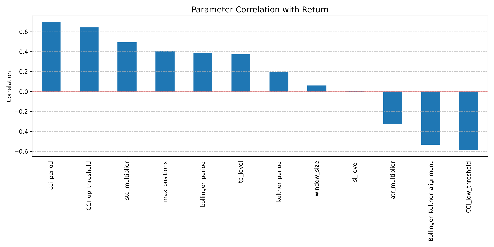
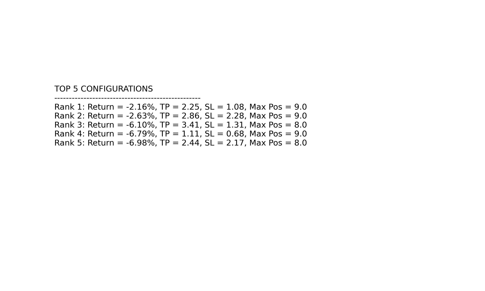
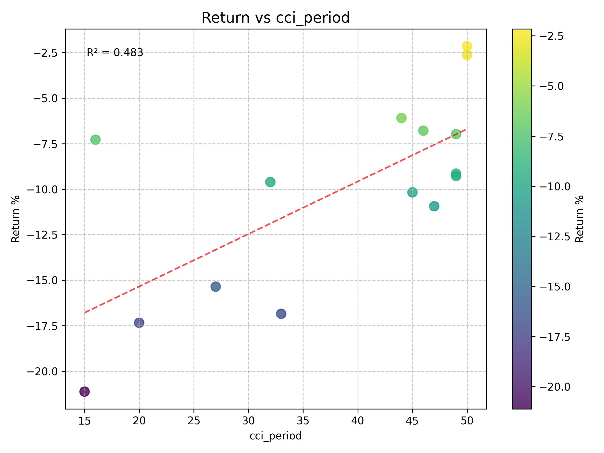
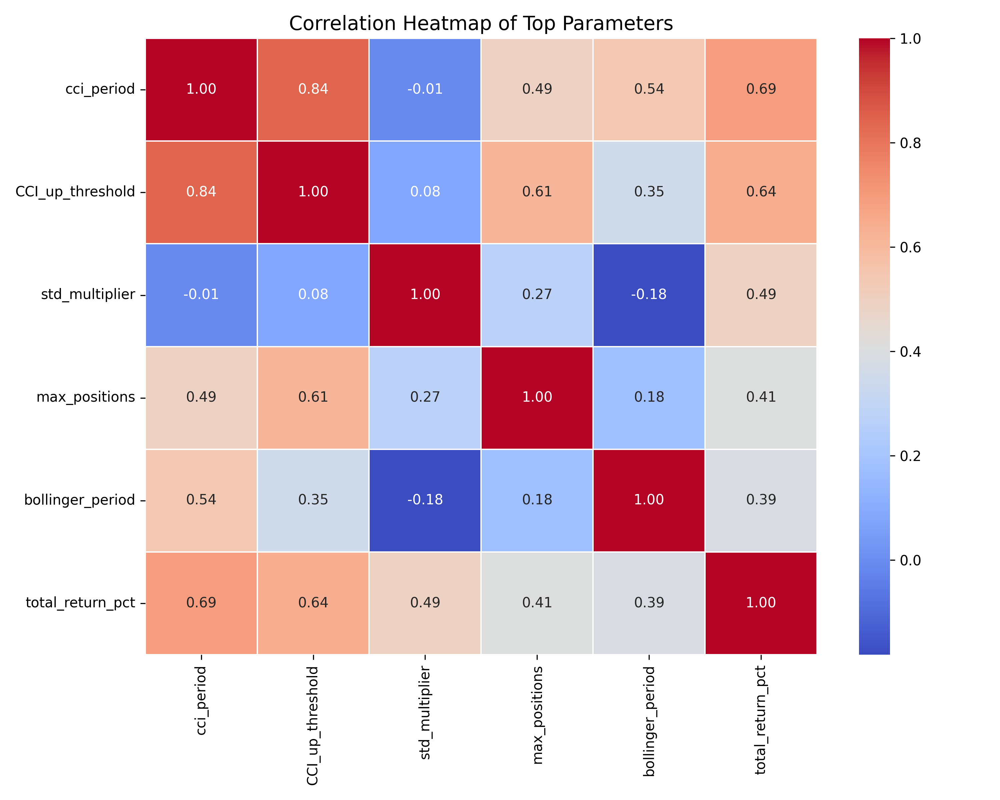
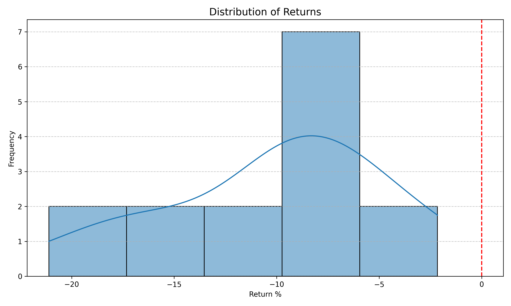
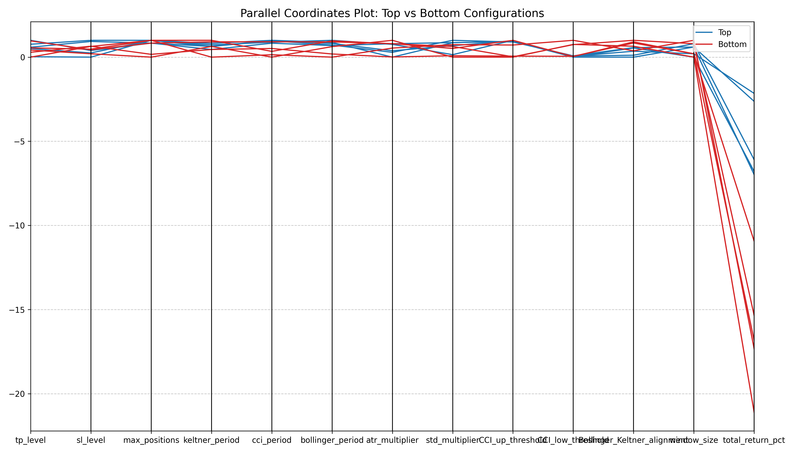
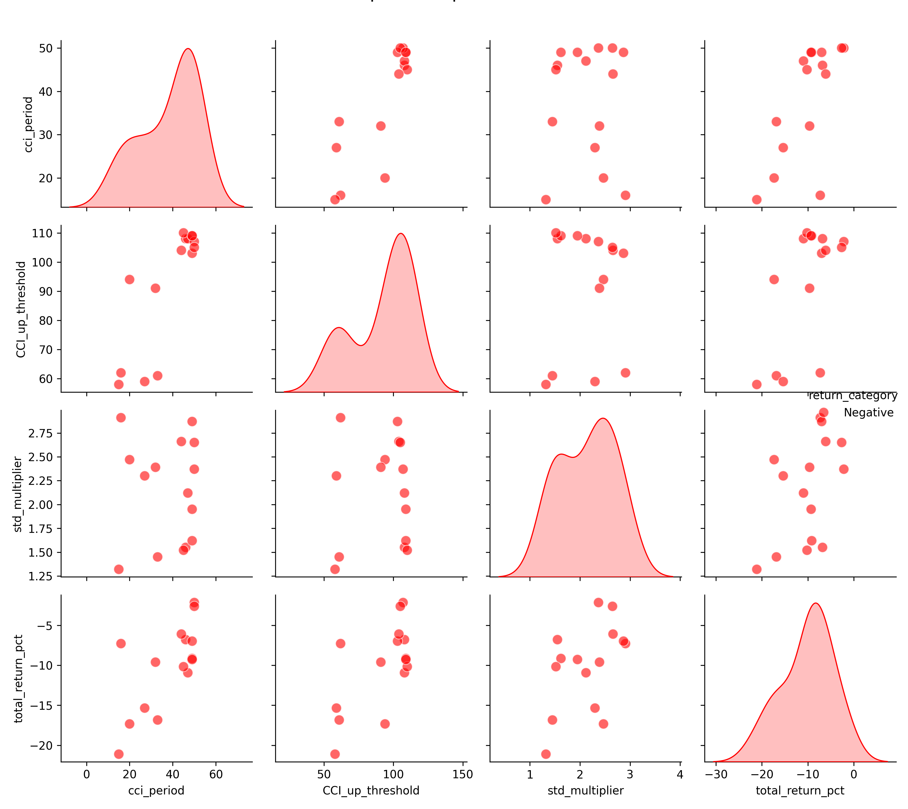

# OptimizationAnalyzer

The `OptimizationAnalyzer` class provides comprehensive functionality for analyzing trading strategy optimization results. It handles loading, processing, analyzing, and visualizing optimization data from backtesting trading strategies with robust error handling and logging capabilities.

## Overview

Trading strategy optimization often generates large datasets with multiple parameters and performance metrics. This class helps traders and developers analyze these results to identify:

- Best-performing parameter combinations
- Parameter sensitivity and correlations
- Performance distribution patterns
- Optimal parameter ranges

The analyzer creates various visualizations and summary statistics to help understand what parameter combinations lead to better performance, making it easier to refine trading strategies.

## Installation

The `OptimizationAnalyzer` class relies on several Python packages:

```python
import pandas as pd
import numpy as np
import matplotlib.pyplot as plt
import seaborn as sns
from matplotlib.gridspec import GridSpec
import os
import sys
from scipy import stats
import datetime
from sklearn.preprocessing import MinMaxScaler
import logging
import traceback
import shutil
```

Ensure these packages are installed in your environment before using this class.

## Basic Usage

```python
# Example usage with a pandas DataFrame of optimization results
import pandas as pd
from optimization_analyzer import OptimizationAnalyzer

# Create or load a DataFrame with optimization results
results_df = pd.DataFrame({
    'tp_level': [1.5, 2.0, 2.5, 3.0, 3.5],
    'sl_level': [1.0, 1.5, 2.0, 2.5, 3.0],
    'max_positions': [1, 2, 3, 4, 5],
    'total_return_pct': [10.5, 15.2, 8.7, 12.3, 9.6]
})

# Initialize the analyzer
analyzer = OptimizationAnalyzer(results_df, output_dir="my_analysis_results")

# Run all analyses
analyzer.run_all_analyses()
```

## Key Features

- **Comprehensive Analysis**: Performs multiple types of analyses on optimization results
- **Visualization**: Creates various plots to help understand parameter relationships
- **Logging**: Robust logging with configurable log levels
- **Error Handling**: Graceful error handling that continues with other analyses if one fails
- **Summary Statistics**: Generates text summaries of key findings
- **Output Management**: Creates and manages output directories for analysis results

## Constructor

### `__init__(optimization_results, output_dir, log_level=logging.INFO)`

Initializes the OptimizationAnalyzer with data and output directory.

**Parameters:**

- `optimization_results` (DataFrame or list): DataFrame containing optimization results
- `output_dir` (str, optional): Directory where analysis results will be saved
- `log_level` (int, optional): Logging level (default: logging.INFO)

**Example:**

```python
analyzer = OptimizationAnalyzer(results_df, "analysis_output", logging.DEBUG)
```

## Core Methods

### `load_data()`

Loads optimization data from the provided DataFrame.

**Returns:**

- `self`: Returns self for method chaining

**Example:**

```python
analyzer.load_data()
```

### `save_summary_statistics()`

Saves summary statistics to a text file and stores the top 10 configurations in a CSV file.

**Returns:**

- `self`: Returns self for method chaining

The summary includes:
- Number of configurations tested
- Average return
- Count and percentage of configurations with positive returns
- Best configuration details
- Parameter correlations with returns
- Optimal parameter ranges from top 5 configurations

**Output Files:**
- `analysis_summary.txt`: Text summary of statistics
- `top_10_configurations.csv`: CSV with the top 10 configurations

**Example of summary statistics output:**

```
========== OPTIMIZATION ANALYSIS ==========
Number of configurations tested: 125
Average return: 7.32%
Configurations with positive returns: 98 (78.4%)

Best configuration:
  tp_level: 2.5
  sl_level: 1.2
  max_positions: 3
  cci_period: 20
  bollinger_period: 21
  std_multiplier: 2.0
  Return: 15.42%

Parameter impact on returns (correlation):
  tp_level: 0.648
  bollinger_period: 0.412
  std_multiplier: 0.384
  cci_period: 0.276
  sl_level: -0.125
  max_positions: 0.098

Optimal parameter ranges (from top 5 configurations):
  tp_level: 2.0 to 3.0
  sl_level: 1.0 to 1.5
  max_positions: 2 to 4
  cci_period: 18 to 26
  bollinger_period: 20 to 25
  std_multiplier: 1.8 to 2.2
```

**Example:**

```python
analyzer.save_summary_statistics()
```

### `run_all_analyses()`

Runs all analysis and visualization methods in sequence, continuing even if individual analyses fail.

**Returns:**

- `self`: Returns self for method chaining

**Example:**

```python
analyzer.run_all_analyses()
```

## Visualization Methods

### `plot_parameter_correlations()`

Creates a bar plot showing the correlation of each parameter with the return.

**Returns:**

- `self`: Returns self for method chaining

**Output File:**
- `1_parameter_correlations.png`: Bar chart showing parameter correlations with returns

**Example Visualization:**



*This example shows the correlation between each parameter and the total return percentage. Positive values indicate that increasing the parameter tends to increase returns, while negative values suggest the opposite. The higher the absolute value, the stronger the relationship.*

**Example:**

```python
analyzer.plot_parameter_correlations()
```

### `plot_top_configurations()`

Creates a visualization showing details of the top 5 performing configurations.

**Returns:**

- `self`: Returns self for method chaining

**Output File:**
- `2_top_configurations.png`: Visualization of top configuration details

**Example Visualization:**



*This visualization displays the parameter values for the top-performing configurations, making it easy to identify patterns among the best results. Each row shows a different configuration ranked by return.*

**Example:**

```python
analyzer.plot_top_configurations()
```

### `plot_parameter_scatter_plots(top_n=5)`

Creates scatter plots for the top parameters versus return, with regression lines.

**Parameters:**

- `top_n` (int, optional): Number of top parameters to plot (default: 5)

**Returns:**

- `self`: Returns self for method chaining

**Output Files:**
- `3_1_scatter_<param1>.png`, `3_2_scatter_<param2>.png`, etc.: Individual scatter plots

**Example Visualization:**



*This scatter plot shows the relationship between a parameter (tp_level) and returns. Each point represents a tested configuration. The color intensity indicates the return value. The red dashed line shows the linear regression trend, and the R² value in the top-left indicates the strength of the relationship.*

**Example:**

```python
analyzer.plot_parameter_scatter_plots(top_n=3)
```

### `plot_correlation_heatmap(top_n=5)`

Creates a heatmap showing correlations between the top parameters.

**Parameters:**

- `top_n` (int, optional): Number of top parameters to include (default: 5)

**Returns:**

- `self`: Returns self for method chaining

**Output File:**
- `4_correlation_heatmap.png`: Correlation heatmap of top parameters

**Example Visualization:**



*This heatmap shows the correlation between different parameters. Darker blue indicates strong positive correlation, while darker red indicates strong negative correlation. The values range from -1 (perfect negative correlation) to 1 (perfect positive correlation). This helps identify which parameters tend to move together or in opposite directions.*

**Example:**

```python
analyzer.plot_correlation_heatmap(top_n=6)
```

### `plot_return_distribution()`

Creates a histogram showing the distribution of returns across all configurations.

**Returns:**

- `self`: Returns self for method chaining

**Output File:**
- `5_return_distribution.png`: Histogram of returns distribution

**Example Visualization:**



*This histogram shows the distribution of returns across all tested configurations. The x-axis represents return percentages, while the y-axis shows frequency. The blue curve is a kernel density estimate showing the overall distribution shape. The red vertical line marks zero return, helping to visualize the proportion of profitable configurations.*

**Example:**

```python
analyzer.plot_return_distribution()
```

### `plot_parallel_coordinates(top_n=5, bottom_n=5)`

Creates a parallel coordinates plot comparing top and bottom configurations.

**Parameters:**

- `top_n` (int, optional): Number of top configurations to include (default: 5)
- `bottom_n` (int, optional): Number of bottom configurations to include (default: 5)

**Returns:**

- `self`: Returns self for method chaining

**Output File:**
- `6_parallel_coordinates.png`: Parallel coordinates comparison plot

**Example Visualization:**



*This parallel coordinates plot compares the parameter values of top-performing configurations (blue lines) with bottom-performing ones (red lines). Each vertical axis represents a different parameter, normalized to a common scale. This visualization helps identify patterns that differentiate successful and unsuccessful parameter combinations.*

**Example:**

```python
analyzer.plot_parallel_coordinates(top_n=3, bottom_n=3)
```

### `plot_pairplot(top_n=3)`

Creates a pairplot showing relationships between the top parameters.

**Parameters:**

- `top_n` (int, optional): Number of top parameters to include (default: 3)

**Returns:**

- `self`: Returns self for method chaining

**Output File:**
- `7_pairplot.png`: Pairplot of top parameters

**Example Visualization:**



*This pairplot matrix shows the relationships between multiple parameters simultaneously. The diagonal contains distribution histograms for each parameter, while the off-diagonal plots show scatter plots between pairs of parameters. Points are color-coded by whether they produced positive (green) or negative (red) returns. This helps identify parameter interactions and clusters of successful configurations.*

**Example:**

```python
analyzer.plot_pairplot(top_n=4)
```

## Internal Methods

### `_setup_logger(log_level)`

Sets up and configures the logger.

**Parameters:**

- `log_level` (int): Logging level

**Returns:**

- `logger` (logging.Logger): Configured logger

### `_calculate_statistics()`

Calculates basic statistics from the optimization data.

### `_check_data_loaded()`

Checks if data is loaded before proceeding with analysis.

**Raises:**

- `ValueError`: If no data is loaded

## Error Handling

The `OptimizationAnalyzer` class has comprehensive error handling with detailed logging:

- Each public method catches exceptions
- Errors are logged with tracebacks at debug level
- Analysis pipeline continues even if individual methods fail
- Figures are properly closed in case of errors

## Notes

- The class expects optimization data to contain at least a `total_return_pct` column
- Output files are numbered sequentially to maintain a logical order
- The output directory is cleared and recreated on initialization
- The class creates a timestamped log file for detailed logging

## Example Output Structure

```
optimization_analysis/
├── analysis_summary.txt
├── top_10_configurations.csv
├── 1_parameter_correlations.png
├── 2_top_configurations.png
├── 3_1_scatter_param1.png
├── 3_2_scatter_param2.png
├── ...
├── 4_correlation_heatmap.png
├── 5_return_distribution.png
├── 6_parallel_coordinates.png
└── 7_pairplot.png
```

## Advanced Usage

### Working with Custom Parameter Sets

```python
analyzer = OptimizationAnalyzer(results_df, "custom_analysis")

# Run specific analyses
analyzer.load_data() \
        .plot_parameter_correlations() \
        .plot_return_distribution() \
        .save_summary_statistics()
```

### Customizing Visualization Counts

```python
analyzer = OptimizationAnalyzer(results_df, "detailed_analysis")

# Customize the number of parameters in various plots
analyzer.plot_parameter_scatter_plots(top_n=10) \
        .plot_correlation_heatmap(top_n=8) \
        .plot_pairplot(top_n=5)
```

### Using Detailed Logging

```python
analyzer = OptimizationAnalyzer(results_df, "debug_analysis", log_level=logging.DEBUG)
analyzer.run_all_analyses()
```

## Interpreting the Visualizations

### Parameter Correlations
The parameter correlations bar chart helps identify which parameters have the strongest influence on returns. Parameters with:
- **High positive correlation**: Increasing the parameter tends to increase returns
- **High negative correlation**: Decreasing the parameter tends to increase returns
- **Near-zero correlation**: The parameter has little direct impact on returns

### Scatter Plots
Scatter plots reveal the detailed relationship between individual parameters and returns:
- **Upward slope**: Parameter generally improves returns as it increases
- **Downward slope**: Parameter generally reduces returns as it increases
- **U-shape or curve**: Parameter has an optimal range in the middle
- **Scattered points with no pattern**: Parameter might interact with others in complex ways

### Correlation Heatmap
The correlation heatmap shows how parameters relate to each other:
- **Strong correlations between parameters**: May indicate redundancy or a common underlying factor
- **Parameters that correlate strongly with returns but not with each other**: Good candidates for combined optimization

### Return Distribution
The return distribution histogram shows how returns are distributed across all tested configurations:
- **Right-skewed distribution**: Strategy has more successful configurations than unsuccessful ones
- **Multiple peaks**: May indicate different "regimes" or parameter clusters
- **Wide distribution**: High sensitivity to parameter changes
- **Narrow distribution**: Low sensitivity to parameter changes

### Parallel Coordinates
The parallel coordinates plot helps identify patterns that distinguish successful and unsuccessful configurations:
- **Parameters where top and bottom lines clearly separate**: Critical parameters for success
- **Parameters where lines cross**: Less predictable impact on performance
- **Tight clustering for top performers on certain parameters**: Indicates optimal ranges

### Pairplot
The pairplot helps identify interaction effects between parameters:
- **Clustering of successful configurations**: Reveals favorable parameter combinations
- **Distinct separation between positive and negative returns**: Shows clear decision boundaries
- **Complex patterns**: May indicate non-linear interactions between parameters

## Requirements

- Python 3.6+
- pandas
- numpy
- matplotlib
- seaborn
- scipy
- scikit-learn