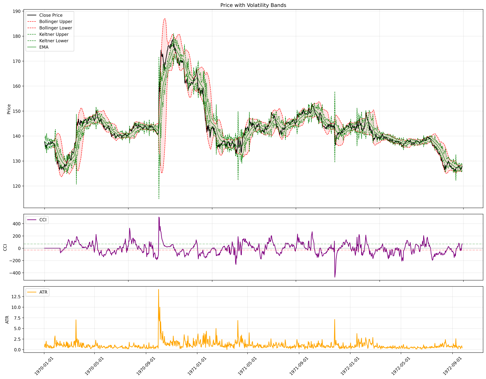
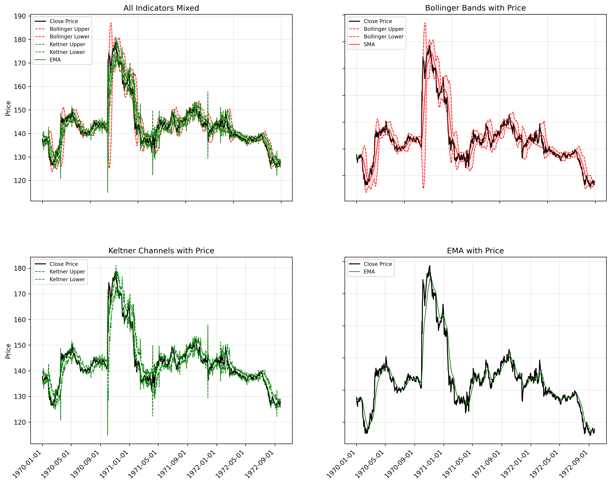
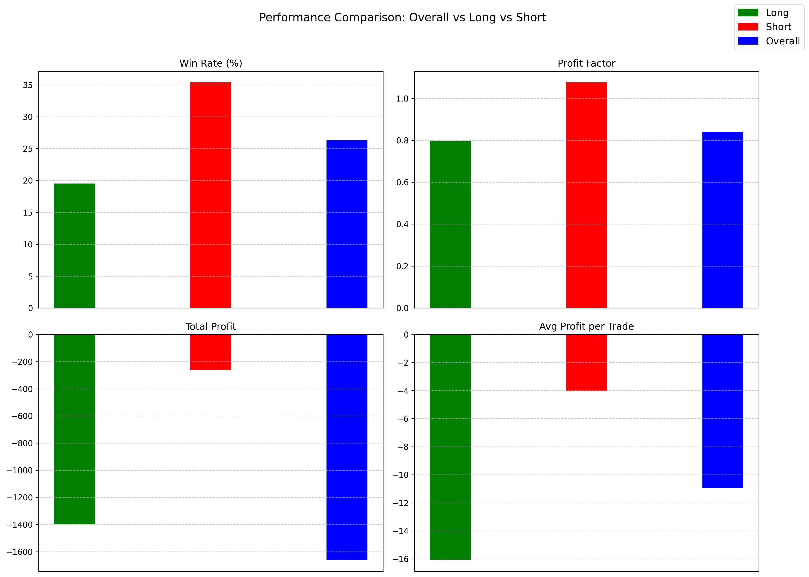
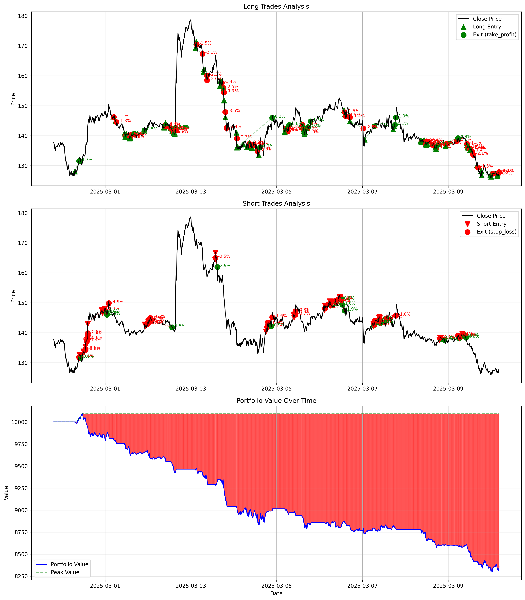
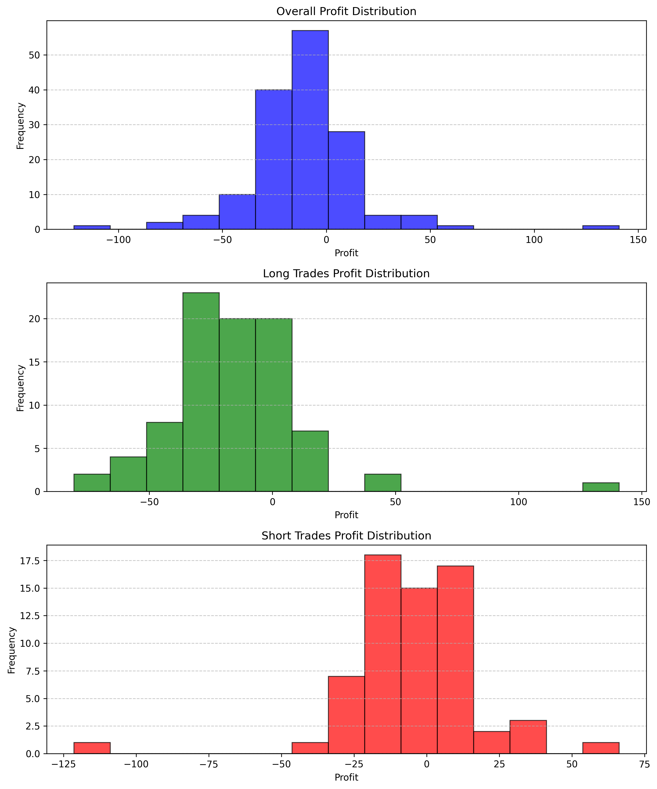
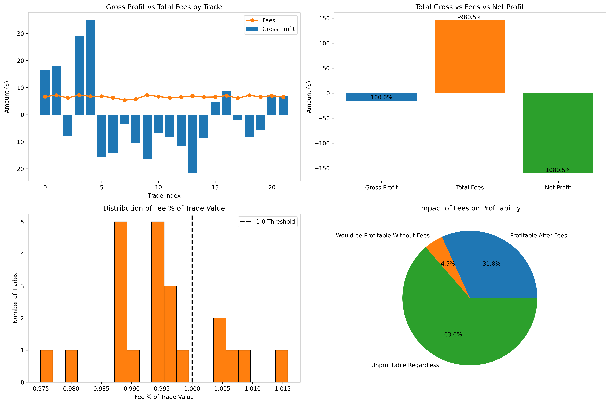

# Visualization

The Mean Reversion Volatility Bands strategy includes comprehensive visualization capabilities through the `TradingVisualizer` class. These visualizations help analyze technical indicators, trading signals, backtest results, and performance metrics.

## Technical Indicators Visualization

### Combined Indicators

The `visualize_indicators` method creates a 3-panel chart showing:

1. **Price with Volatility Bands**: Displays price action along with Bollinger Bands and Keltner Channels
2. **CCI Indicator**: Shows the Commodity Channel Index with overbought/oversold thresholds
3. **ATR Indicator**: Displays the Average True Range to monitor volatility



### Split Indicators View

The `visualize_indicators_splited` method provides a 2×2 grid layout that separately visualizes:

1. **All Indicators Mixed**: Combined view of price with all indicators
2. **Bollinger Bands**: Price with Bollinger Bands and SMA
3. **Keltner Channels**: Price with Keltner Channels and EMA
4. **EMA**: Price with Exponential Moving Average

This split view helps in understanding how each indicator is behaving individually.



## Trading Signals

The `plot_trading_signals` method creates a 2-panel chart showing:

1. **Long Signals**: Price action with long entry signals marked
2. **Short Signals**: Price action with short entry signals marked

This visualization helps in understanding where the strategy identifies potential entry points.



## Backtest Results

The `plot_backtest_results` method generates a 3-panel chart showing:

1. **Long Trades Analysis**: Displays long entry and exit points with profit/loss percentages
2. **Short Trades Analysis**: Displays short entry and exit points with profit/loss percentages
3. **Portfolio Value**: Shows the equity curve with drawdown periods highlighted

This comprehensive view allows for analysis of individual trades in the context of overall portfolio performance.



## Performance Metrics

### Performance Comparison

The `plot_performance_comparison` method creates a 2×2 grid of bar charts comparing:

1. **Win Rate**: Percentage of profitable trades for overall, long, and short positions
2. **Profit Factor**: Ratio of gross profits to gross losses
3. **Total Profit**: Cumulative profit for each position type
4. **Average Profit per Trade**: Mean profit/loss per trade

This visualization helps in understanding which types of trades are performing better.

### Profit Distribution

The `plot_profit_histograms` method generates 3 histograms showing the distribution of:

1. **Overall Profits**: Profit distribution across all trades
2. **Long Trade Profits**: Profit distribution for long positions only
3. **Short Trade Profits**: Profit distribution for short positions only

This helps in understanding the profitability patterns and identifying if the strategy has a skewed or balanced profit distribution.



### Fee Impact Analysis

The `visualize_fee_impact` method creates a 2×2 grid showing detailed analysis of how trading fees affect overall performance:

1. **Gross Profit vs Total Fees by Trade**: Bar chart of gross profit with overlaid line plot of fees for the first 50 trades
2. **Total Gross vs Fees vs Net Profit**: Bar chart comparing total gross profit, total fees, and net profit with percentage annotations
3. **Distribution of Fee % of Trade Value**: Histogram showing how fees as a percentage of trade value are distributed across all trades
4. **Impact of Fees on Profitability**: Pie chart categorizing trades into "Profitable After Fees", "Would be Profitable Without Fees", and "Unprofitable Regardless"

This visualization provides critical insights into how transaction costs affect strategy performance and helps in optimizing fee structures or trade sizing.



## Usage Example

```python
# Initialize visualizer
visualizer = TradingVisualizer()

# Visualize indicators
indicators_fig = visualizer.visualize_indicators(indicators_df)
visualizer.save_figure(indicators_fig, "images/indicators.pdf")

# Visualize trading signals
signals_fig = visualizer.plot_trading_signals(signals_df)
visualizer.save_figure(signals_fig, "images/signals.pdf")

# Visualize backtest results
backtest_fig = visualizer.plot_backtest_results(signals_df, portfolio_df, trades_df)
visualizer.save_figure(backtest_fig, "images/backtest.pdf")

# Visualize profit distribution
profit_fig = visualizer.plot_profit_histograms(trades_df)
visualizer.save_figure(profit_fig, "images/profit_distribution.pdf")

# Visualize fee impact analysis
fee_impact_fig = visualizer.visualize_fee_impact(trades_df, fee_analysis_df)
visualizer.save_figure(fee_impact_fig, "images/fee_impact.pdf")
```

## Customization Options

The visualizer supports customization through:

- **Figure Size**: All visualization methods accept a `figsize` parameter to control output dimensions
- **Resolution Control**: The `save_figure` method accepts a `dpi` parameter to control output resolution
- **Default Settings**: The visualizer can be initialized with default figure sizes that apply to all charts

These visualization tools provide a comprehensive view of strategy performance, helping to identify strengths, weaknesses, and potential improvements in the trading approach.